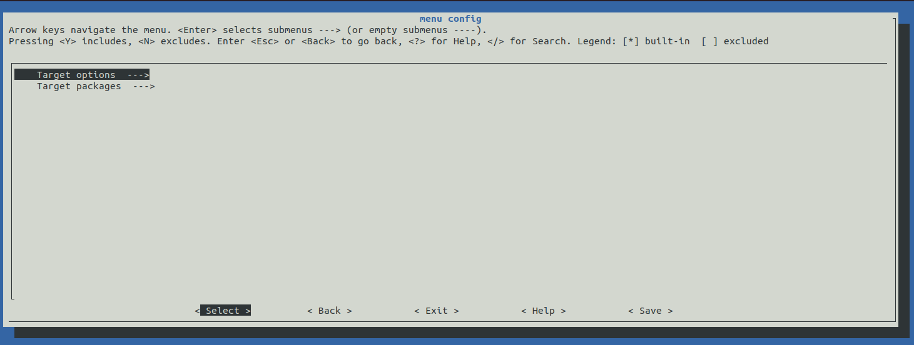
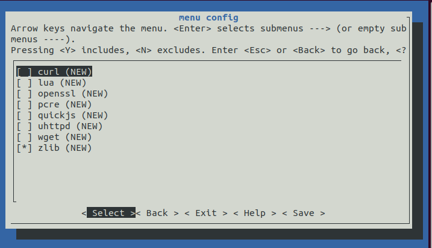
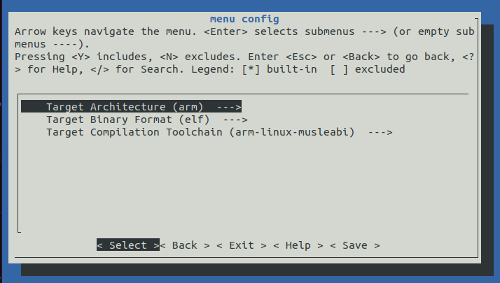
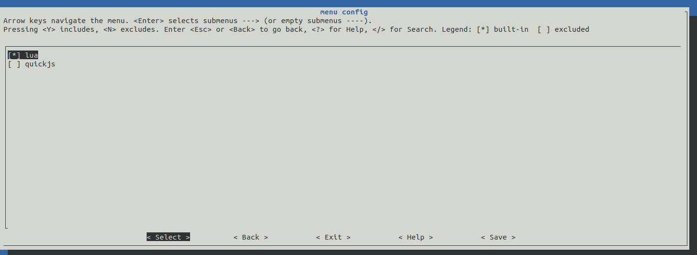
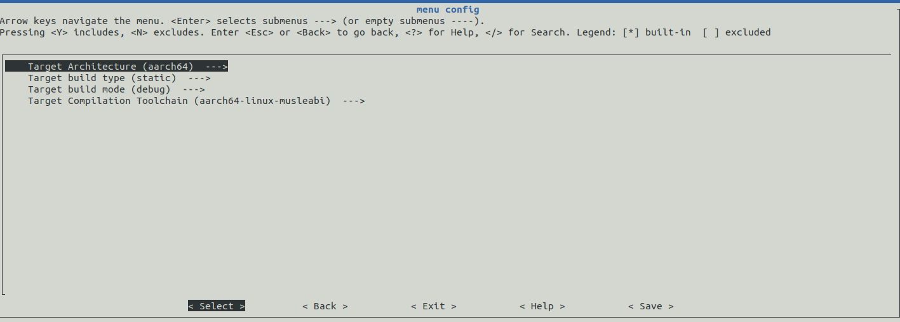
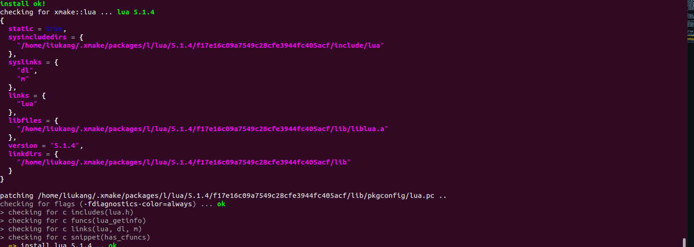
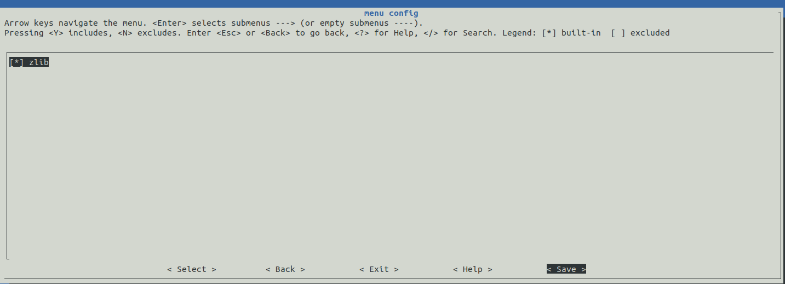
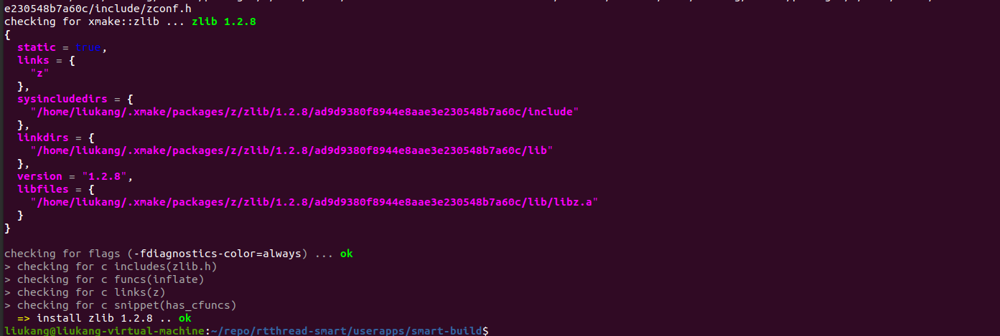
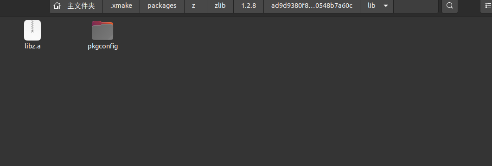

# Smart-Build

## 基本功能

- 针对系列的软件包，构建类似 buildroot 的 menuconfig 选择软件包及配置；
- 支持两种以上架构的编译工具链，如arm、aarch64、risc-v 等中的两种，并可选择；
- 支持软件包的不同版本，并处理好依赖关系，并从网络上下载下来到本地；
- 支持 release 模式编译，支持 debug 模式编译；
- 支持按静态库模式编译，支持按动态库模式编译；
- 支持在最终输出到根文件系统时 strip 掉多余的符号信息；

## 整体设计

展示 smart-build 的 menuconfig 配置界面： 

1. smart-build 存放位置

   

2. menuconfig 主界面展示

   

3. gnu_app 界面展示，支持多版本的选择：
	
   

4. 工具链以及芯片架构选择界面，目前可选择 arm 或者 aarch64 架构：
   
   
   
6. 配置保存，当选项配置完成后，选择 Save 保存当前配置。smart-build 会保存当前配置到 .config 文件中。

## 目录结构

```
smart-build
smart-build
├───figures                     				   // 文档使用图片
├───rt-xrpo							               // 包索引
|   |───packages
|   |	|───c
|   |	|   |───cul
|   |	|   |   |───patches         				// 补丁文件
|   |	|   |   |	|───xmake.lua       			// 编译配置
|   |   |───d
|───scripts                         				// 配置文件，包括界面配置
|	|───buildroot.lua	
|	|───menuconfig.lua	
|	|───packages.lua	
|	|───platform.lua	
|───toolchains							            // 工具链
|	|───aarch64.lua					
|	|───arm.lua
|───xmake.lua
│   README.md                       				// 工具使用说明

```

## 命令行

```shell
Command options (buildroot):
        --menuconfig                 config and build gnu_app.
        --clean                      clean build dir.
        --distclean                  clean build and all installed pkg.
```

### menuconfig

打开 menuconfig 界面，配置完成后，自动拉取软件包进行编译安装。

### clean

清理编译目录

### distclean

清理编译目录和所有已经安装的包

## 编译流程

1. 用户选择要编译的 gnu-app
2. 配置工具链和平台架构 （arm、aarch64）
3. 保存并且退出
4. 自动从仓库拉取对应版本的 gnu-app
5. 构建 APP 并将生成物存放在 rt-smart/userapps/root/bin
6. 根据现有脚本制作 rootfs 镜像文件

### 生成可执行文件

smart-build 工具支持生成可执行文件。以 lua app 为例，演示配置流程：

1. 选择 lua 软件包：

   

2. 选择工具链和目标平台：

   

3. 保存，退出，smart-build 工具会自动拉取软件包并进行编译：

   

4. 可执行文件路径。：

   

### 生成静态库文件

smart-build 工具支持生成静态库文件。以 zlib app 为例，演示配置流程：

1. 选择 zlib app:

   

2. 参考生成可执行文件流程，配置工具链和目标平台。

3. 保存，退出，smart-build 工具会自动拉取软件包并进行编译：

   

4. 静态库文件：

   

## 软件包列表

- [ ] art-pi-demo-web
- [ ] busybox
- [ ] c-ares
- [ ] curl
- [ ] dropbear
- [ ] dungeonrush
- [ ] examples
- [ ] freetype
- [ ] iperf3
- [ ] libmodbus
- [ ] libpng
- [ ] librws
- [ ] lighttpd
- [x] lua
- [ ] lz4
- [ ] minishell
- [ ] mqttc
- [ ] ncurses
- [ ] openssl-1.1.1i
- [ ] pcre
- [ ] posixtestsuite
- [ ] quickjs
- [ ] sdl
- [ ] sqlite
- [ ] stupid-ftpd
- [ ] uhttpd-cgi-test
- [ ] uhttpd
- [ ] wget
- [x] zlib
