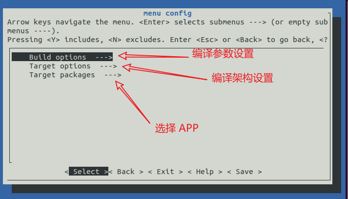
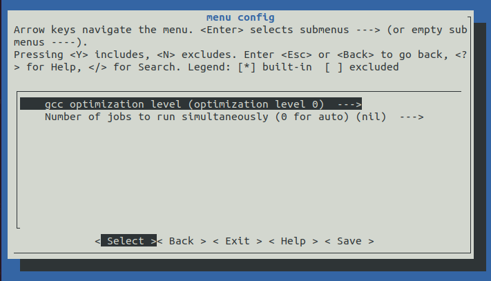

# Smart-Build

## 基本功能

- 针对系列的软件包，构建类似 buildroot 的 menuconfig 选择软件包及配置；

- 支持两种以上架构的编译工具链，如arm、aarch64、risc-v 等中的两种，并可选择；

- 支持软件包的不同版本，并处理好依赖关系，并从网络上下载下来到本地；

- 支持 release 模式编译，支持 debug 模式编译；

- 支持按静态库模式编译，支持按动态库模式编译；

- 支持在最终输出到根文件系统时 strip 掉多余的符号信息；

## 输出内容

- [x] 能够基于RT-Thread Smart 应用程序构建的方式，构建一个个的程序，并输出到 rt-smart/userapps/root 目录下，
- [ ] 可以使用已有脚本转成 rootfs 的映像文件
- [x] 可通过 menuconfig 可视化配置工具链和编译选项
- [x] 支持两种以上架构的编译工具链，如 arm、aarch64、risc-v 等中的两种
- [ ] 支持软件包的不同版本，并处理好依赖关系，并从网络上下载下来到本地
- [ ] 支持 Debug/Release 编译模式切换
- [ ] 支持静态库和动态库切换
- [ ] 支持在最终输出到根文件系统时strip掉多余的符号信息

## 整体设计

展示 smart-build 的 menuconfig 配置界面： 

1. smart-build 存放位置

   

2. menuconfig 主界面展示

   

3. gnu_app 界面展示，支持多版本的选择：
	
   

4. 工具链以及芯片架构选择界面，目前可选择 arm 或者 aarch64 架构：
   
   
   
5. 编译选项配置界面：

   

6. 配置保存，当选项配置完成后，选择 Save 保存当前配置。smart-build 会保存当前配置到 .config 文件中。

## 编译流程

1. 用户选择要编译的 gnu-app
2. 配置工具链和平台架构 （arm、aarch64）
3. 配置编译选项 （-o0/1/2/3/4/s、debug/release）
4. 保存并且退出
5. 自动从仓库拉取对应版本的 gnu-app
6. 构建 APP 并将生成物存放在 rt-smart/userapps/root 或者 
7. 根据现有脚本制作 rootfs 镜像文件

