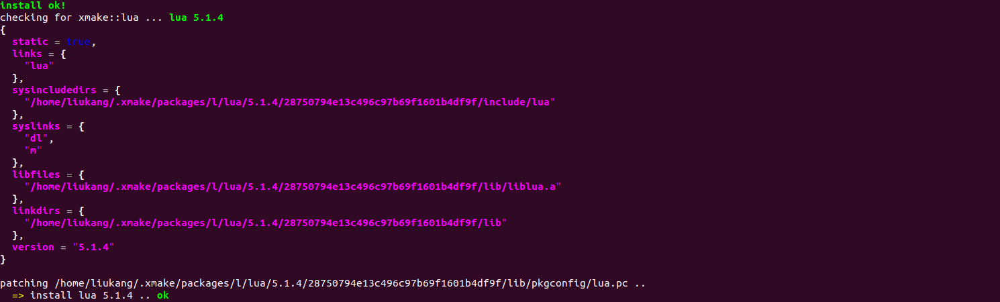

# smart-build

smart-build 是一款基于 xmake 实现的类 buildroot 的交叉构建系统，用于 RT-Thread Smart 开源操作系统。可以编译基础的软件包（调用xmake & xrepo的方式），构建出基本的应用程序，并输出相关文件到根文件系统文件夹下。

## 基本功能

- 支持两种以上架构的编译工具链，目前支持： arm、aarch64；
- 支持不同版本的软件包；
- 支持 release/debug 模式编译；
- 支持按静态库模式编译，支持按动态库模式编译；
- 支持在最终输出到根文件系统时 strip 掉多余的符号信息；

## 目录结构

smart-build 目录结构如下所示：

```
smart-build
├───figures                                         // 文档使用图片
├───rt-xrpo                                         // 包索引
|   |───packages
|   |   |───c
|   |   |   |───cul                                 // 软件包名字
|   |   |   |   |───patches                         // 补丁文件
|   |   |   |   |───xmake.lua                       // 编译配置
|   |   |───d
|───scripts                                         // 配置文件，包括界面配置
|   |───buildroot.lua                               // 自定义task脚本
|   |───menuconfig.lua                              // 菜单逻辑脚本
|   |───packages.lua                                // 菜单选项脚本
|   |───platform.lua                                // 平台设置脚本
|───toolchains                                      // 工具链配置 
|   |───aarch64.lua                                 // aarch64 架构工具链配置脚本
|   |───arm.lua                                     // arm 架构工具链配置脚本
|───xmake.lua                                       // 工程主文件
│───README.md                                       // 工具使用说明
│───二次开发文档.md                                   // 二次开发使用说明
```

## 安装方法

### Ubuntu

1. 首次使用，需要安装 xmake 环境

   ```shell
   $ bash <(curl -fsSL https://xmake.io/shget.text)
   $ source ~/.xmake/profile
   ```

2. 如果需要使用最新的一些 xmake 特性，使用下面的命令更新到 dev 分支

   ```shell
   xmake update -s dev
   ```

3. 在 rttthread-smart/useraps 目录下，使用下面的命令下载 smart-build 工具

   ```shell
   git clone https://github.com/xmake-io/smart-build.git
   ```

4. smart-build 存放位置


## 命令行

目前 smart-build 工具支持的命令行如下：

```shell
Command options (buildroot):
        --menuconfig                 config and build gnu_app.
        --clean                      clean build dir.
        --distclean                  clean build and all installed pkg.
```

### menuconfig

打开 menuconfig 界面，配置完成后，自动拉取软件包进行编译安装。

```lua
xmake buildroot --menuconfig
```

### clean

编译安装前，删除build目录

```lua
xmake buildroot --clean
```

### distclean

编译安装前，删除build目录，以及所有已经安装的apps（默认位置$HOME/.xmake/packages/*）

```lua
xmake buildroot --distclean
```

## 使用方法

### 生成可执行文件

smart-build 工具支持生成可执行文件。以 lua app 为例，演示配置流程：

1. 使用命令 `xmake buildroot --menuconfig` 打开配置界面

   

2. 选择 **Target options** 配置目标架构和工具链

   

3. 选择 **Target packages** 配置软件包

   

4. 打开**Interpreter landuages and scripting**选项，选择 lua 软件包

   

5. 保存配置，会自动进行编译：

   

6. 生成的可执行文件，会自动拷贝到 **userapps/root/bin** 目录下

   


## 参考链接

[RT-Thread 官方网站](https://www.rt-thread.org/)

[Xmake 官方网站](https://xmake.io/#/zh-cn/)

[rt-smart 仓库地址]([rt-thread: RT-Thread是一个来自中国的开源物联网操作系统，它提供了非常强的可伸缩能力：从一个可以运行在ARM Cortex-M0芯片上的极小内核，到中等的ARM Cortex-M3/4/7系统，甚至是多核，64位的ARM Cortex-A，MIPS32/64处理器的功能丰富系统 - Gitee.com](https://gitee.com/rtthread/rt-thread/tree/rt-smart/))


