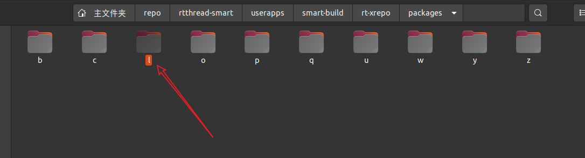
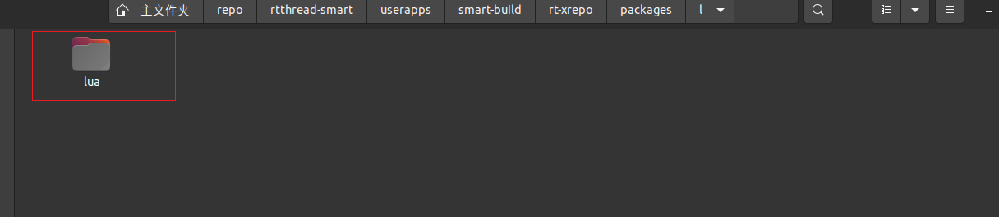

# 二次开发指导

## 添加 gnu-app 

添加 app 到 smart-build 工具。以 lua 为例进行演示：

1. 在 smart-build/rt-xrepo/packages 目录下，app 按照字母排序放入对应的目录中；lua 软件包的开头字母为 l，所以放在 l 文件夹下面：

   

2. 在该目录下创建 app 文件夹：

    

3. 创建 xmake.lua 文件：

   ```lua
   package("lua")	-- 包名字
   
       set_homepage("http://lua.org")
       set_description("A powerful, efficient, lightweight, embeddable scripting language.")
   
       add_urls("http://117.143.63.254:9012/www/rt-smart/packages/lua-$(version).tar.gz")			-- 添加包路径
   
       add_versions("5.1.4", "b038e225eaf2a5b57c9bcc35cd13aa8c6c8288ef493d52970c9545074098af3a")	-- 添加包版本信息
   
       add_includedirs("include/lua")
       if not is_plat("windows") then
           add_syslinks("dl", "m")
       end
   
       on_load(function (package)
           package:addenv("PATH", "bin")
       end)
   
       on_install("cross", "linux", "macosx", "windows", "android", "bsd", function (package)
           local sourcedir = os.isdir("src") and "src/" or "" -- for tar.gz or git source
           io.writefile("xmake.lua", format([[
               if is_mode("release") then
                   add_rules("mode.release")
               end
               local sourcedir = "%s"
               local pd = os.getenv("PROJ_DIR")
               target("lualib")											-- 生成静态库文件
                   set_kind("static")
                   set_basename("lua")
                   add_headerfiles(sourcedir .. "*.h", {prefixdir = "lua"})
                   add_files(sourcedir .. "*.c|lua.c|luac.c|onelua.c")
                   add_defines("LUA_COMPAT_5_2", "LUA_COMPAT_5_1")
                   if is_plat("linux", "bsd") then
                       add_defines("LUA_USE_LINUX")
                       add_defines("LUA_DL_DLOPEN")
                   elseif is_plat("macosx") then
                       add_defines("LUA_USE_MACOSX")
                       add_defines("LUA_DL_DYLD")
                   elseif is_plat("windows") then
                       -- Lua already detects Windows and sets according defines
                       if is_kind("shared") then
                           add_defines("LUA_BUILD_AS_DLL", {public = true})
                       end
                   end
   			-- 生成 lua 可执行文件
               target("lua")
                   set_kind("binary")
                   add_files(sourcedir .. "lua.c")
                   add_deps("lualib")
                   if not is_plat("windows") then
                       add_syslinks("dl")
                   end
   
               -- 生成 luac 可执行文件
               target("luac")
                  set_kind("binary")
                  add_files(sourcedir .. "luac.c")
                  add_deps("lualib")				-- 检测 lualib 静态库生成完成
                  if not is_plat("windows") then
                      add_syslinks("dl")
                  end
           ]], sourcedir))
   
           local configs = {}
           if package:config("shared") then
               configs.kind = "shared"
           end
           package:config_set("pic", false)   								-- 关闭 -fPIC 选项
           import("package.tools.autoconf").buildenvs(package)				-- 获取工具链配置
           import("package.tools.xmake").install(package, configs)			-- 编译
       end)
   ```

## 添加工具链

smart-build 工具目前支持的工具链类型有：arm-linux-musleabi、aarch64-linux-musleabi。添加工具链可参考本章节。

1. 添加工具链配置文件。在 toolchains 目录下，新建 xxx.lua 文件。

2. xxx.lua 文件可参考格式如下：

   ```lua
   toolchain("arm-linux-musleabi") 																-- 第一行设置工具链的名字
       set_kind("standalone")
       set_sdkdir("$(projectdir)/../../tools/gnu_gcc/arm-linux-musleabi_for_x86_64-pc-linux-gnu")	-- 设置工具链的路径
       on_load(function(toolchain)
       os.setenv("PROJ_DIR", os.projectdir())  --For lua embed build script
       toolchain:load_cross_toolchain() 															-- 加载工具链
       toolchain:set("toolset", "cxx", "arm-linux-musleabi-g++")
   
       -- 设置 C/C++ 编译参数
       toolchain:add("cxflags", "-march=armv7-a -marm -msoft-float -D__RTTHREAD__  -Wall -n --static", {force = true})               -- 设置链接参数                              
       toolchain:add("ldflags", "-march=armv7-a -marm -msoft-float -D__RTTHREAD__ -Wall -n --static", {force = true})  
       -- 设置静态链接脚本路径
       toolchain:add("ldflags", "-T $(projectdir)/../linker_scripts/arm/cortex-a/link.lds", {force = true})
       -- 设置静态库
       toolchain:add("ldflags", "-Wl,--whole-archive -lrtthread -Wl,--no-whole-archive", {force = true})
       -- 设置 rt-smart 头文件路径
       toolchain:add("includedirs", "$(projectdir)/../sdk/rt-thread/include")
       toolchain:add("includedirs", "$(projectdir)/../sdk/rt-thread/components/dfs")
       toolchain:add("includedirs", "$(projectdir)/../sdk/rt-thread/components/drivers")
       toolchain:add("includedirs", "$(projectdir)/../sdk/rt-thread/components/finsh")
       toolchain:add("includedirs", "$(projectdir)/../sdk/rt-thread/components/net")
       -- 设置静态库路径
       toolchain:add("linkdirs", "$(projectdir)/../sdk/rt-thread/lib/arm/cortex-a")
   	
       -- 判断是否带编译信息
       if is_mode("debug") then
           toolchain:add("cxflags", "-g -gdwarf-2", {force = true})
       end
       -- release模式
       if is_mode("release") then
           toolchain:add("cxflags", "-O2", {force = true})
       end
   
       end)
   toolchain_end()
   ```

3. 修改根目录下 xmake.lua 文件。根据目标架构，选择对应的工具链：

   ```lua
   includes("scripts/platform.lua")
   includes("scripts/packages.lua")
   includes("toolchains/arm.lua")
   includes("toolchains/aarch64.lua")
   
   set_xmakever("2.6.9")
   set_version("0.0.1")
   
   add_repositories("rt-xrepo $(projectdir)/rt-xrepo")
   
   -- arm 工具链
   if is_arch("arm") then
       set_toolchains("arm-linux-musleabi")
   -- aarch64
   elseif is_arch("aarch64") then
       set_toolchains("aarch64-linux-musleabi")
   -- 添加自定义工具链
   elseif is_arch("xxxxx") then
       set_toolchains("xxxxx-linux-musleabi")  
   end
   
   task("buildroot")
       on_run("scripts.buildroot")
       set_menu {  usage = "xmake buildroot [options] [arguments]",
                   description = "Generate buildroot for rt-smart.",
                   options = {
                       {nil, "menuconfig", "k", nil, "config and build project."},
                       {nil, "clean",      "k", nil, "clean build dir."},
                       {nil, "distclean",  "k", nil, "clean build and all installed pkg."}
   		        }
                }
   ```

4. 修改可视化配置界面。工具链和架构的配置路径为 `scripts/platform.lua`；将自定义的工具链和架构添加到该文件中：

   ```lua
   option("arch")
       set_default("arm")
       set_showmenu(true)
       set_category("Target options")
       set_description("Target Architecture")
       set_values("arm", "aarch64", "xxx")  												-- 添加新的架构选项
   option_end()
   
   option("toolchains")
       set_default("arm-linux-musleabi")
       set_showmenu(true)
       set_category("Target options")
       set_description("Target Compilation Toolchain")
       set_values("arm-linux-musleabi", "aarch64-linux-musleabi", "xxxx-linux-musleabi")	-- 添加新架构的工具链
   option_end()
   ```

